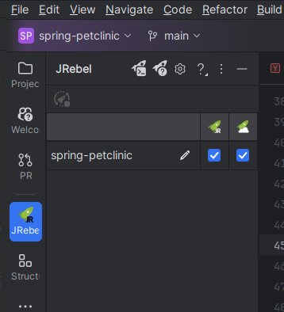

# JR Broker demo guide (Kubernetes / minikube)

The JR Broker and the demo applications (`petclinic-dev`, `petclinic-staging`,
`supplements-api`) run inside a local
[minikube](https://minikube.sigs.k8s.io/) cluster, in the `jrebel` namespace.

The broker JAR and the JRebel agent are **baked into the images at build time**.
The download URLs are exposed as Docker build args so you can point at a
different release. 

#### The demo application

The deployment is three JRebel-enabled JVMs talking to one broker:

 - **`petclinic-dev`** and **`petclinic-staging`** — two instances of the Spring
   PetClinic web app, built from the same image but mapped to separate broker
   zones (`frontend-dev` / `frontend-staging`) to mimic a dev vs. staging
   environment. Each exposes the PetClinic UI on port `8080`.
 - **`supplements-api`** — a small backend (in `broker/demo-app/supplements-api`)
   that serves a list of supplements at `/supplements-api/supplements`. The
   PetClinic frontends call it cluster-internally at
   `http://supplements-api:8080` to render the Supplements page.

The JR Broker sits in the middle: every app's JRebel agent connects out to it,
and the IntelliJ plugin connects to the broker to sync code changes and attach a
debugger to any of the three JVMs — no per-pod port-forward required.

#### Prerequisites

**Cluster tooling**
 - [minikube](https://minikube.sigs.k8s.io/docs/start/) and `kubectl` installed.
 - Unix style shell (Linux, macOS, WSL).

#### 0. IDE and project setup

**IntelliJ IDEA + JRebel plugin**
 - Recent IntelliJ IDEA installed (tested on 2025.3.4.1 build #IU-253.32098.101).
 - Install the **JRebel and XRebel** plugin (tested on 2026.2.1) from the JetBrains Marketplace
   (`Settings → Plugins → Marketplace`, search for "JRebel"). Restart the IDE
   and activate JRebel.
 - Import project as a **Maven** project if you haven't already (right-click the root `pom.xml` → `Add as Maven project`).
 - Enable JRebel **and** remote-server support on the `spring-petclinic` module
   from the JRebel project panel — tick **both** checkboxes. `rebel.xml` and
   `rebel-remote.xml` should appear under `src/main/resources/`.

   
 - Add `broker/demo-app/supplements-api` as a Maven project (right-click its
   `pom.xml` → `Add as Maven project`) and enable JRebel on it the same way —
   both boxes. `rebel.xml` and `rebel-remote.xml` should appear under
   `broker/demo-app/supplements-api/src/main/resources/`.

**Broker license + config**
 - Place your JR Broker license at `broker/config/rebelbroker.lic`. The file is
   gitignored; you must drop it in manually.
 - The committed `broker/config/config.yml` is the upstream default config from
   the broker distribution.

#### 1. Start minikube
```shell
minikube start
```

#### 2. Point your shell at minikube's Docker daemon
The images are built directly inside the minikube node — no registry push, no
`minikube image load`:
```shell
eval $(minikube docker-env)
```

#### 3. Build the broker image
Pass `--build-arg BROKER_DIST_URL=...` if you need a different broker build
(see the Notes section below).
```shell
docker build \
  -f broker/k8s/broker.Dockerfile \
  -t jr-broker:latest \
  broker/k8s
```

#### 4. Build the application images
Pass `--build-arg JREBEL_AGENT_URL=...` if you need a different agent build
(see the Notes section below).

Pass `--no-cache` if you want to force a full rebuild.

Petclinic (run from the project root — the build context must include the
petclinic source and `mvnw`):
```shell
docker build \
  -f broker/k8s/petclinic.Dockerfile \
  -t spring-petclinic:latest \
  .
```

Supplements API:
```shell
docker build \
  -t supplements-api:latest \
  broker/demo-app/supplements-api
```

Verify all three images are visible inside the cluster:
```shell
docker images | grep -E 'jr-broker|spring-petclinic|supplements-api'
```

#### 5. Create the namespace, license secret, config map, and deploy
The broker pod mounts three things from outside the image: its license (a
`broker-license` Secret at `/root/.jrbroker/rebelbroker.lic`), its config (a
`broker-config` ConfigMap at `/broker/config.yml`, overriding the copy baked
into the image), and a `broker-state` PersistentVolumeClaim at `/root/.jrbroker`
that persists the broker's installation GUID and preferences across pod
restarts. The PVC is declared inside `broker/k8s/broker.yaml` and is applied
together with the Deployment. Create the namespace first, then the Secret from
the license file you placed at `broker/config/rebelbroker.lic` (see
Prerequisites), and the ConfigMap from `broker/config/config.yml`:
```shell
kubectl apply -f broker/k8s/namespace.yaml
kubectl -n jrebel create secret generic broker-license \
  --from-file=rebelbroker.lic=broker/config/rebelbroker.lic
kubectl -n jrebel create configmap broker-config \
  --from-file=config.yml=broker/config/config.yml
kubectl -n jrebel create secret generic zone-tokens \
  --from-literal=frontend-dev=frontend-dev-token \
  --from-literal=frontend-staging=frontend-staging-token \
  --from-literal=backend=backend-token
```

The application pods read their zone token from the `zone-tokens` Secret via
`secretKeyRef` and pass it to the JRebel agent via
`-Drebel.broker.token=$(BROKER_TOKEN)` — see the env blocks in
`petclinic.yaml` and `supplements-api.yaml`. Keep the token values in sync
with the `zones:` section of `broker/config/config.yml`.

Then deploy:
```shell
kubectl apply -f broker/k8s/broker.yaml
kubectl apply -f broker/k8s/supplements-api.yaml
kubectl apply -f broker/k8s/petclinic.yaml
```

Wait for all pods in the `jrebel` namespace to reach the `Running` state:
```shell
kubectl -n jrebel get pods -w
```

Tail the broker log to confirm startup:
```shell
kubectl -n jrebel logs deploy/broker -f
```

The application pods should print the JRebel banner — check them with:
```shell
kubectl -n jrebel logs deploy/petclinic-dev -f
kubectl -n jrebel logs deploy/petclinic-staging -f
kubectl -n jrebel logs deploy/supplements-api -f
```

#### 6. Connect the IntelliJ plugin to the broker
The IDE plugin runs on the host and needs to reach the broker WebSocket port.
Forward the broker service to localhost (keep this running in its own terminal):
```shell
kubectl -n jrebel port-forward svc/broker 7000:7000
```

In IntelliJ IDEA open the Services tab, add a new "JRebel Broker" service with
URL `http://localhost:7000` and `ide-token` auth token (see `config.tml`). Selecting the new `localhost`
tree node should show `Connection status: Connected` on the right.

You should see three zones — `frontend-dev`, `frontend-staging`, `backend` —
each with one JVM:
 - `petclinic-dev` and `petclinic-staging` with the remote module
   `org.springframework.samples.spring-petclinic`
 - `supplements-api` with the remote module `supplements-api`
 - Selecting a module tree node should show `Local IntelliJ module "xxx" matches remote id yyy. Synchronization enabled.` on the right panel. If not, check the rebel.xml and rebel-remote.xml files are present in the correct `src/main/resources/` paths (as well as in the built artifact) and that the module names match the remote IDs in the logs.

#### 7. Open the applications in a browser
Use `minikube service` to grab a URL for each frontend (each call opens a tunnel
in its own terminal):
```shell
minikube service -n jrebel petclinic-dev --url
minikube service -n jrebel petclinic-staging --url
```
Alternatively, port-forward directly:
```shell
kubectl -n jrebel port-forward svc/petclinic-dev 8081:8080
kubectl -n jrebel port-forward svc/petclinic-staging 8082:8080
```

The `supplements-api` service is consumed by the petclinic apps cluster-internally
at `http://supplements-api.jrebel.svc.cluster.local:8080`; expose it only if you
want to hit it directly.

#### 8. Sync a code change
Pick either the petclinic or the supplements-api module and modify a class.
For example, in `WelcomeController.welcome()` add:
```java
    @GetMapping("/")
    public String welcome() {
        System.out.println("Hello from welcome controller");
        return "welcome";
    }
```
Recompile the class (`Build -> Recompile 'WelcomeController.java'` or
`Ctrl + Shift + F9`). In the IDE Services tab select the
`org.springframework.samples.spring-petclinic` module under the desired JVM
(e.g. `petclinic-dev`) and click **Sync**.

The target pod's log should show class-reload entries:
```
JRebel: Reloading class 'org.springframework.samples.petclinic.system.WelcomeController'.
```
Reload the page in the browser and the new log line appears in
`kubectl -n jrebel logs deploy/petclinic-dev`.

The same flow works against the `supplements-api` module providing the data for  Supplements Store section in Petclinic application.  
Edit `SupplementsRepository.getSupplements()` so out-of-stock items are filtered out —
change the predicate from `>= 0` to `> 0`:
```java
    public List<Supplement> getSupplements() {
        return getSupplementsData().stream().filter(supplement -> supplement.getStock() > 0).collect(Collectors.toList());
    }
```
Recompile the class (`Build -> Recompile 'SupplementsRepository.java'` or
`Ctrl + Shift + F9`), then in the IDE Services tab select the `supplements`
module under the `supplements-api` JVM and click **Sync**. The pod log shows the
class reload:
```
JRebel: Reloading class 'org.zt.demo.supplements.SupplementsRepository'.
```
in `kubectl -n jrebel logs deploy/supplements-api`.

Supplements with a stock of `0` no longer appear in the API response and Supplements Store menu item in Petclinic app.

#### 9. Debug a JVM
In the IDE Services tab, navigate to the JVM you want to debug under its zone
(e.g. `petclinic-dev`). Set a breakpoint in IntelliJ — for example on the
`return` statement in `WelcomeController.welcome()`. Select the JVM tree node
and click **Debug**. The debugger session is proxied through the broker, so no
extra port-forward to `5005` is needed.

Reload the application page; the breakpoint should hit. The **Debug** button is
available only for **JVM** tree nodes, not for zone or module nodes.

#### 10. Tear down
Remove everything the guide created, in order:

1. **Stop the host-side port-forwards.** Press `Ctrl-C` in each
   `kubectl port-forward` terminal (broker, petclinic-dev, petclinic-staging).

2. **Delete the namespace.** This removes all cluster resources created in
   step 5 — deployments, services, pods, ConfigMap, Secret, and the
   `broker-state` PVC (which also wipes the persisted broker GUID and
   preferences) — because they're all scoped to `jrebel`:
   ```shell
   kubectl delete namespace jrebel
   ```

3. **Remove the locally-built images from minikube's Docker daemon.** Without
   this they linger until you `minikube delete`:
   ```shell
   eval $(minikube docker-env)
   docker rmi jr-broker:latest spring-petclinic:latest supplements-api:latest
   ```

4. **(Optional) Stop or wipe minikube.** `minikube stop` keeps the cluster
   state for a later restart; `minikube delete` removes the VM/container
   entirely (including any images you didn't clean up in step 3):
   ```shell
   minikube stop      # pause
   # or
   minikube delete    # full wipe
   ```

5. **(Optional) Remove generated IDE files.** The JRebel IDE plugin writes
   `rebel.xml` and `rebel-remote.xml` next to your `src/main/resources/`
   when you enable JRebel on a module (per the Prerequisites). Delete them
   if you don't want them tracked:
   ```shell
   rm -f src/main/resources/rebel.xml src/main/resources/rebel-remote.xml
   rm -f broker/demo-app/supplements-api/src/main/resources/rebel.xml \
         broker/demo-app/supplements-api/src/main/resources/rebel-remote.xml
   ```

---

### Notes and troubleshooting
 - **Build args.** Three URLs are exposed:
   - `BROKER_DIST_URL` (default `https://dl.zeroturnaround.com/broker/jr-broker-dist-2025.3.2.zip`) in `broker/k8s/broker.Dockerfile`.
   - `JREBEL_AGENT_URL` (default `https://dl.zeroturnaround.com/jrebel/releases/jrebel-2026.2.1-nosetup.zip`) in `broker/k8s/petclinic.Dockerfile` and `broker/demo-app/supplements-api/Dockerfile`.

   Override any of them with `--build-arg NAME=URL` on the `docker build` command.
 - **Forcing a full rebuild.** Source changes invalidate the `COPY` layer
   automatically, so you rarely need to force a rebuild. If you do (e.g. to
   refresh the base image or re-pull `apt-get` packages), `docker build --pull`
   refreshes the base image, and `--no-cache` discards the layer cache
   entirely. Note that `--no-cache` *also* wipes the Maven cache mount in this
   BuildKit version — so the next build pays the full dependency-download cost
   again.
 - **`ImagePullBackOff` on a pod** means the locally-built image is not in
   minikube's Docker daemon. Re-run `eval $(minikube docker-env)` in the build
   shell and rebuild — `imagePullPolicy: Never` is set in the manifests so K8s
   will only use the local image.
 - **Broker license.** The `broker-license` Secret is mounted into the broker
   pod via `subPath`, so updating the Secret does *not* propagate to a running
   pod. To rotate the license:
   ```shell
   kubectl -n jrebel create secret generic broker-license \
     --from-file=rebelbroker.lic=broker/config/rebelbroker.lic \
     --dry-run=client -o yaml | kubectl apply -f -
   kubectl -n jrebel rollout restart deploy/broker
   ```
   On a healthy start the broker logs `RebelBroker License active`. Without the
   Secret the pod fails to start with a volume-mount error; without a *valid*
   license it starts but logs `RebelBroker License not active`.
 - **Broker config.** `broker/config/config.yml` is mounted into the pod as
   the `broker-config` ConfigMap at `/broker/config.yml`, which overrides the
   copy baked into the image. Like the license, the mount uses `subPath` and
   does *not* hot-reload — edit the file and apply, then restart the broker:
   ```shell
   kubectl -n jrebel create configmap broker-config \
     --from-file=config.yml=broker/config/config.yml \
     --dry-run=client -o yaml | kubectl apply -f -
   kubectl -n jrebel rollout restart deploy/broker
   ```
 - **Broker URL inside the cluster** is `http://broker.jrebel.svc.cluster.local:7000`.
   The manifests already wire each app to the right zone via
   `-Drebel.broker.url`.
 - **Architecture note.** The agent path is hard-coded to `libjrebel64.so`
   (`amd64`). On an Apple Silicon host start minikube with `--driver=docker` and
   an `amd64` ISO, or switch the agent path to `libjrebelaarch64.so` in
   `broker/k8s/petclinic.yaml` and `broker/k8s/supplements-api.yaml`.
