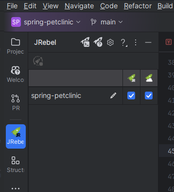

# JR Broker demo guide

#### Prerequsites
 - [Docker](https://docs.docker.com/get-docker/)
 - IntelliJ IDEA (Tested on IntelliJ IU 2024.2.2 Build #IU-242.22855.74 and 2024.3.1.1 Build #IU-243.22562.218)
 - JR artifacts in `broker/dist` directory
   - `broker/dist/jr-broker-server-0.0.1-SNAPSHOT.jar` - the broker server artifact
   - `broker/dist/jrebel/` - unpacked JRebel agent standalone distribution containing `jrebel.jar` and `lib/` directory
   - `borker/dist/jr-ide-intellij.zip` - JR IntelliJ IDEA plugin distribution archive

## ! The URL for the artifacts are distributed separately !
If possible please use modify the `broker/dist/download.sh` script with correct URLs and use it to download the artifacts. The relevant section is...  

```bash
#### CHANGE THESE VALUES ####
# IDEA_PLUGIN_URL: URL to the JRebel for IntelliJ IDEA plugin
export IDEA_PLUGIN_URL="https://<>/jr-ide-intellij.zip"
# JREBEL_AGENT_STANDALONE_URL: URL to the JRebel Agent Standalone distribution
export JREBEL_AGENT_STANDALONE_URL="https://<>/jrebel-dist.zip"
# BROKER_JAR_URL: URL to the JRebel Broker Server JAR
export BROKER_JAR_URL="https://<>/jr-broker-server-0.0.1-SNAPSHOT.jar"
#############################
```
... and execute `cd broker/dist && ./download.sh && cd -`

After successful download the directory structure should look like this:
```
❯ tree broker 
broker
├── broker.yml
├── DEMO.md
├── dist
│   ├── download.sh
│   ├── jr-broker-server-0.0.1-SNAPSHOT.jar
│   ├── jr-broker-server-0.0.1-SNAPSHOT.jar.sha1
│   ├── jrebel
│   │   ├── jrebel.jar
│   │   └── lib
│   │       ├── jrebel32.dll
│   │       ├── jrebel64.dll
│   │       ├── libjrebel32.so
│   │       ├── libjrebel64.dylib
│   │       ├── libjrebel64.so
│   │       └── libjrebelaarch64.so
│   ├── jrebel-dist.zip
│   ├── jrebel-dist.zip.sha1
│   ├── jr-ide-intellij.zip
│   └── jr-ide-intellij.zip.sha1
├── GUIDE.md
├── img
│   └── project-config.png
└── petclinic.yml
```

Quick start:
1. Install JR IntelliJ IDEA plugin from `jr-ide-intellij.zip` using [Install from disk](https://www.jetbrains.com/help/idea/installing-a-plugin-from-the-disk.html) feature. Restart the IDE if needed. Activate JRebel in IDE.
2. Start Broker container with `docker compose -f broker/broker.yml up`. Broker will be available at <http://localhost:7000>.
3. Navigate to IntelliJ IDEA services tab and add a new "JRebel Broker" service. Use `http://localhost:7000` as the broker URL. No auth token.
4. Click on the new tree node called `localhost`. Verify that on the right side panel `Connection status` displays "Connected".
5. Enable JRebel and remote server support on IntelliJ module "spring-petclinc" using JRebel project panel.  
  
Make sure to check both checkboxes. Two new files `rebel.xml` and `rebel-remote.xml` must appear in the `src/main/resources` directory.  
```
❯ ls src/main/resources/rebel*
src/main/resources/rebel-remote.xml  src/main/resources/rebel.xml
```
6. Build demo application with `./mvnw clean spring-boot:build-image -DskipTests` in project root directory.  
When build succeeds the output ends with `Successfully built image 'docker.io/library/spring-petclinic:3.4.0-SNAPSHOT'` message.
7. Start the application with `docker compose -f broker/petclinic.yml up`. Application will be available at <http://localhost:8080>.  
Console output should show JRebel banner:
```
petclinic-1  | 2025-03-16 22:35:08 JRebel:  Starting logging to file: /home/cnb/.jrebel/jrebel.log
petclinic-1  | 2025-03-16 22:35:08 JRebel:  
petclinic-1  | 2025-03-16 22:35:08 JRebel:  #############################################################
petclinic-1  | 2025-03-16 22:35:08 JRebel:  
petclinic-1  | 2025-03-16 22:35:08 JRebel:  JRebel Agent 2025.0.1-SNAPSHOT (202503162223)
petclinic-1  | 2025-03-16 22:35:08 JRebel:  (c) Copyright 2007-2025 Perforce Software, Inc.
petclinic-1  | 2025-03-16 22:35:08 JRebel:  
petclinic-1  | 2025-03-16 22:35:08 JRebel:  Over the last 1 days JRebel prevented
petclinic-1  | 2025-03-16 22:35:08 JRebel:  at least 0 redeploys/restarts saving you about 0 hours.
petclinic-1  | 2025-03-16 22:35:08 JRebel:  
petclinic-1  | 2025-03-16 22:35:08 JRebel:  JRebel started in remote server mode.
petclinic-1  | 2025-03-16 22:35:08 JRebel:  
petclinic-1  | 2025-03-16 22:35:08 JRebel:  
petclinic-1  | 2025-03-16 22:35:08 JRebel:  #############################################################
petclinic-1  | 2025-03-16 22:35:08 JRebel:  
petclinic-1  | 2025-03-16 22:35:08 JRebel: Starting embedded remoting on port 0.
petclinic-1  | 2025-03-16 22:35:08 JRebel: WARN Invalid 'dir' defined in class path of rebel.xml (unknown): Directory '/home/siim/projects/spring-petclinic/target/classes' does not exist
petclinic-1  | 2025-03-16 22:35:08 JRebel: Embedded remoting started successfully with '127.0.0.1:40117'.
```
In IDE plugin services tab JR broker should have a single JVM in zone "demo" and the JVM should have one deployed remote module with id "org.springframework.samples.spring-petclinic".  
8. In `WelcomeController` class method `welcome` add a new STDOUT logging statement.  
```java
    @GetMapping("/")
    public String welcome() {
        System.out.println("Hello from welcome controller");
        return "welcome";
    }
``` 
Recompile the class with "Build -> Recompile 'WelcomeController.java'" or "Ctrl + Shift + F9".
Select the `org.springframework.samples.spring-petclinic` module node in tree view and click "Sync" button.

A successful sync notification appears in the bottom right corner of IDE . "JRebel console" tool window (bottom right) will show full sync log.
The petclinic application container STDOUT should show log lines about class reloading:
```
petclinic-1  | 2025-03-16 22:44:59 JRebel: Adding/Updating org/springframework/samples/petclinic/system/WelcomeController.class
petclinic-1  | 2025-03-16 22:44:59 JRebel: Adding/Updating META-INF/sbom/application.cdx.json
petclinic-1  | 2025-03-16 22:44:59 JRebel: Adding/Updating META-INF/build-info.properties
petclinic-1  | 2025-03-16 22:44:59 JRebel: Reloading class 'org.springframework.samples.petclinic.system.WelcomeController'.
```  
Reloading application page http://localhost:8080 in the browser will print a new log line: "Hello from welcome controller"
9. Navigate tp `WelcomeController` class method `welcome` and set a breakpoint on the return statement. Select JVM tree node and click "Debug" button.
A debugger session should start and refreshing application page should hit the breakpoint.  
NB! The debugger button is available *only for JVM* nodes and not for others!
